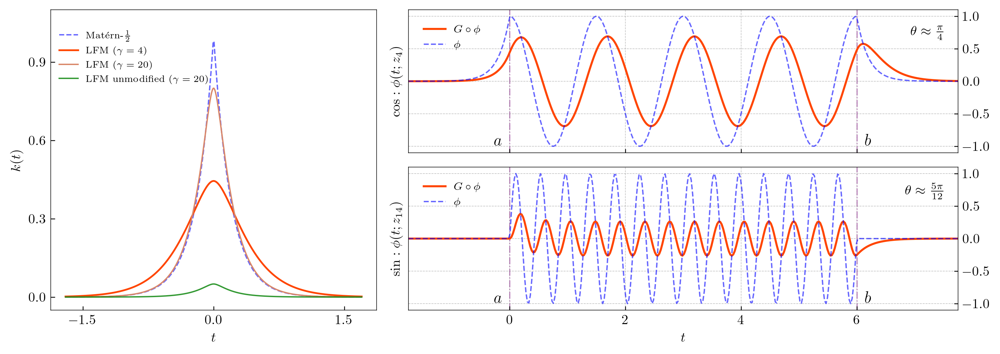

This repository contains a PyTorch implementation of DLFM-VFRF, presented in the paper *"Adaptive RKHS Fourier Features for Compositional Gaussian Process Models."* 

The implementation is mainly built on the [GPyTorch](https://github.com/cornellius-gp/gpytorch) package. `requirements.txt` contains a small list of package versions required to run the code. 

The work proposes a set of RKHS Fourier features for GP models derived from a convolution operation governed by ODEs:

$$
\text{Cov}[f(t), v_m] = \int_{-\infty}^tG(t-\tau)\phi_m(\tau)\mathrm{d}\tau =
\begin{cases}
  \frac{\cos(z_i(t-a)+\theta)}{\beta\sqrt{z_i^2+\gamma^2}} + \xi_i 
  & i =0,\ldots,M,\\
  \frac{\sin(z_i(t-a)+\theta)}{\beta\sqrt{z_i^2+\gamma^2}} + \xi_i
  & i =M+1,\ldots, 2M,
\end{cases}
$$
$$
\mathbf{\phi}(x)  = [1, \cos(z_1(x-a)),\cdots,\cos(z_M(x-a)), \sin(z_1(x -a)),\cdots,\sin(z_M(x-a))],
$$

